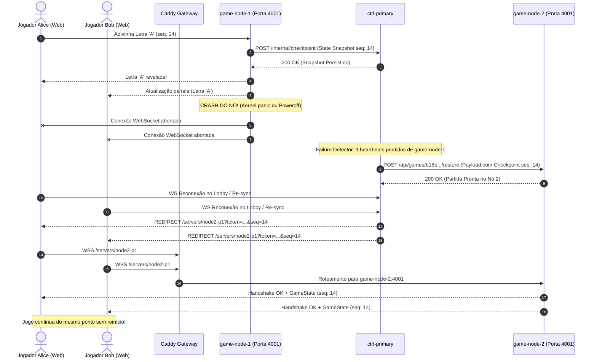

# Planejamento de Reestruturação Distribuída: Forca Distribuída em System Containers (Incus/LXC)

## 1. Visão Geral Executiva & Objetivos SRE
Este documento estabelece o plano arquitetural, a modelagem de confiabilidade (SRE) e o roadmap técnico detalhado para a transição do projeto **Forca Distribuída** (atualmente rodando em containers Docker monolíticos na VPS `15.204.243.66`) para uma arquitetura distribuída resiliente, elástica e tolerante a partição baseada em **System Containers (Incus / LXC)** sob o domínio `forca.matheus-alves.dev`.

O sistema emula um ambiente de nuvem / micro-datacenter bare-metal dentro da VPS, desacoplando o ciclo de vida dos componentes em três camadas fundamentais:
- **Camada de Borda (Host Gateway):** Reverse Proxy Caddy com terminação TLS, roteamento dinâmico sem interrupção de conexões WebSockets e arbitragem de tráfego de entrada.
- **Plano de Controle (Control Plane):** Cluster de orquestração com Lobby e Matchmaking em par **Ativo/Passivo (Primary-Backup)** protegido contra Split-Brain via Fencing Tokens e Lease Locks.
- **Plano de Dados (Data Plane):** Pool elástico de $N$ nós de execução (LXC) executando instâncias de jogo 1x1 supervisionadas por `systemd`, com auto-healing em dois níveis (processo e nó) e migração de partidas com garantia de idempotência.

---

## 2. Topologia de Rede e Arquitetura do Sistema

```mermaid
flowchart TD
    Client([Jogadores Web / Internet]) -->|HTTPS :443 / WSS| Caddy["Host Gateway: Caddy Reverse Proxy\n- Active Healthcheck no Lobby\n- Upstream Dinâmico via Admin API :2019\n- TLS forca.matheus-alves.dev"]

    subgraph BridgeNet ["Rede Privada Virtual Incus (incusbr0: 10.10.10.0/24)"]
        subgraph ControlPlane ["Plano de Controle (Ativo / Passivo + Fencing)"]
            Ctrl1["LXC ctrl-primary (ATIVO)\nIP: 10.10.10.10:8088\n- Lobby, Fila e Pareamento\n- Failure Detector & State Store\n- Auto-Provisioner Daemon\n- Proxy Socket Incus: /run/incus.socket"]
            Ctrl2["LXC ctrl-backup (STANDBY)\nIP: 10.10.10.20:8088\n- Watchdog Heartbeat (1s)\n- Réplica de Snapshots\n- Auto-promoção com Fencing Token\n- Proxy Socket Incus: /run/incus.socket"]
            Ctrl1 <-->|Sync State & Heartbeat HTTP| Ctrl2
            Ctrl1 -.->|Lease Lock / Fencing Token| SharedHostLock[("Host Shared Volume / Lease File\n/run/cluster/leader.lock")]
            Ctrl2 -.->|Lease Lock / Fencing Token| SharedHostLock
        end

        subgraph DataPlane ["Plano de Execução (Pool Elástico de Workers)"]
            subgraph LXC_W1 ["LXC game-node-1 (10.10.10.101)"]
                S1["systemd"]
                G1["Game Server 1 (Porta 4001)"]
                G2["Game Server 2 (Porta 4002)"]
                S1 --> G1
                S1 --> G2
            end

            subgraph LXC_W2 ["LXC game-node-2 (10.10.10.102)"]
                S2["systemd"]
                G3["Game Server 3 (Porta 4001)"]
                G4["Game Server 4 (Porta 4002)"]
                S2 --> G3
                S2 --> G4
            end

            subgraph LXC_Auto ["LXC game-node-N (Auto-Healing) (10.10.10.103+)"]
                SE["systemd"]
                G5["Game Server N (Porta 4001)"]
                SE --> G5
            end
        end
    end

    Caddy -->|/ e /lobby (Preferencial Ativo)| Ctrl1
    Caddy -.->|Failover imediato se Primário cair| Ctrl2

    Caddy -.->|WebSocket /servers/node1-p1| G1
    Caddy -.->|WebSocket /servers/node1-p2| G2
    Caddy -.->|WebSocket /servers/node2-p1| G3
    Caddy -.->|WebSocket /servers/node2-p2| G4
    Caddy -.->|WebSocket /servers/nodex-p1| G5

    G1 & G2 & G3 & G4 & G5 <-->|Checkpoints & Heartbeats a cada lance| Ctrl1
    Ctrl1 & Ctrl2 -->|Provisionamento via Socket Incus| IncusDaemon[("Incus Daemon no Host\n/var/lib/incus/unix.socket")]
```

---

## 3. Análise Crítica de Confiabilidade & Engenharia de Sistemas Distribuídos

### 3.1 Prevenção de Split-Brain no Plano de Controle (Ativo/Passivo)
* **O Risco:** Em uma arquitetura de 2 nós (`ctrl-primary` e `ctrl-backup`), não existe quórum de maioria simples ($N/2 + 1$). Se ocorrer uma partição transitória de rede na bridge virtual ou se o processo primário congelar temporariamente por GC/IO, o `ctrl-backup` pode assumir erroneamente que o primário morreu e se auto-promover. Se ambos os nós se considerarem Ativos simultaneamente:
  - Ambos aceitarão conexões e alocarão partidas conflitantes;
  - Ambos tentarão orquestrar containers no Incus gerando duplicidade e race conditions;
  - Snapshots de jogos serão sobrescritos com estados divergentes.

* **Mitigações Arquiteturais Implementadas:**
  1. **Fencing Token Monotônico (`leader_epoch`):**
     - O estado do cluster mantém um número inteiro monotônico estritamente crescente (`epoch`).
     - A cada transição de liderança, o novo líder incrementa o `epoch` (ex: de $k$ para $k+1$).
     - Todas as chamadas para os nós de dados (`game-node-X`) e para o Caddy exigem o cabeçalho `X-Cluster-Epoch: <epoch>`.
     - Os nós de jogo rejeitam qualquer comando ou checkpoint com `epoch` inferior ao maior já registrado (`HTTP 409 Conflict: Stale Epoch`).
  2. **Lease Lock em Disco Compartilhado (Host Volume Tie-Breaker):**
     - Montagem de um diretório efêmero do host (`/run/forca-cluster/`) em ambos os containers de controle.
     - O nó ativo mantém um arquivo de lock com lease time (`leader.lease`), renovado a cada 1 segundo com TTL de 3 segundos via `flock` atômico do Linux.
     - O backup só se promove se o lock estiver expirado e inalcançável por mais de 3.5 segundos.
  3. **Caddy como Árbitro de Tráfego Externo:**
     - O Caddy atua como autoridade final para clientes externos usando política de balanceamento estrita (`lb_policy first` com active health check a cada 1s). O tráfego de `/` e `/lobby` é direcionado a exatamente um nó por vez.
  4. **Fencing Ativo (STONITH via Incus):**
     - Ao detectar a morte do primário e assumir a liderança com sucesso, o backup invoca imediatamente a API do Incus para forçar a terminação ou reinício limpo do nó antecessor (`incus restart ctrl-primary --force`), eliminando nós zumbis antes de aceitar tráfego de dados.

---

### 3.2 Comunicação Segura com a API do Incus em Containers Unprivileged
* **O Risco:** No Incus/LXC, containers rodam no modo *unprivileged* por padrão por razões de segurança de kernel (UID shifting via `subuid`/`subgid`, onde o root do container corresponde ao UID 1000000 no host). O socket administrativo do host (`/var/lib/incus/unix.socket`) pertence a `root:incus-admin` (UID 0 real) com permissões `0660`. A montagem direta desse socket via volume bind comum resulta em erro imediato `EACCES (Permission Denied)`.

* **Solução Arquitetural Implementada (Duplo Mecanismo):**
  1. **Abordagem Nativa Recomendada: Proxy Device do Incus:**
     - Utilização do mecanismo nativo de proxy do Incus que cria um túnel seguro de socket UNIX entre o namespace do host e o namespace do container, realizando a tradução de permissões de forma transparente:
       ```bash
       incus config device add ctrl-primary incus-socket proxy \
         connect=unix:/var/lib/incus/unix.socket \
         listen=unix:/run/incus.socket \
         bind=container \
         mode=0660 security.uid=0 security.gid=0
       ```
     - O controller dentro do container acessa `/run/incus.socket` como se fosse um socket local, com privilégios restritos gerenciados pelo próprio daemon do Incus.
  2. **Abordagem Alternativa via REST API TLS com Certificados de Cliente:**
     - O Incus é configurado para escutar na interface interna da bridge `10.10.10.1:8443`:
       ```bash
       incus config set core.https_address 10.10.10.1:8443
       ```
     - Gera-se um par de chaves e certificado client no container (`incus-client.crt` e `incus-client.key`) e adiciona-se à lista de certificados confiáveis do Incus (`incus config trust add-certificate incus-client.crt`).
     - O controller comunica-se via HTTPS com `https://10.10.10.1:8443` autenticado por mTLS.

---

### 3.3 Dynamic Upstreams no Caddy sem Queda de WebSockets
* **O Risco:** Quando um novo nó de jogo é criado dinamicamente pelo Auto-Healing (`game-node-N`), o Caddy precisa começar a rotear conexões para `/servers/nodeN-p1` e `/servers/nodeN-p2`. Se a reconfiguração for realizada via `systemctl restart caddy`, todos os processos filhos são destruídos e centenas de conexões WebSockets de partidas em andamento em outros nós cairão abruptamente.

* **Soluções Técnicas & Integração:**
  1. **Caddy Graceful Reload (`caddy reload`):**
     - O Caddy implementa drenagem graciosa de conexões (*connection draining*). Durante o reload, a configuração antiga mantém os sockets WebSockets ativos abertos até os clientes desconectarem, enquanto novas requisições HTTP e novos handshakes WS passam para a nova tabela de roteamento.
  2. **Atualização Dinâmica via Caddy Admin API (`:2019`):**
     - O host expõe a Admin API do Caddy apenas para a bridge interna ou o controller envia payload JSON para o endpoint de configuração do Caddy:
       ```bash
       curl -s -X POST "http://localhost:2019/load" \
         -H "Content-Type: application/json" \
         -d @/etc/caddy/caddy_dynamic_config.json
       ```
     - Ou adição cirúrgica de rotas via `PATCH /config/apps/http/servers/srv0/routes`:
       Inserção atômica do matcher e upstream do novo container sem reler arquivos estáticos.
  3. **Roteamento Baseado em Nomes de Host Internos do Incus:**
     - Configuração de upstream dinâmico por wildcard ou resolução DNS interna do Incus (`<nome-do-container>.incus`), eliminando a necessidade de reconfigurar o Caddy para cada nó se um proxy interno de despacho for utilizado.

---

### 3.4 Estratégia de Rede e Alocação de IPs Estáticos no Incus
* **O Risco:** O servidor DHCP interno do Incus (`dnsmasq`) aloca leases dinâmicos. Caso um nó reinicie ou seja clonado, a alteração de seu IP invalida instantaneamente as regras de roteamento do Caddy e as tabelas de nós ativos do Controller.

* **Tabela de Endereçamento IP Estático do Cluster:**

| Domínio de Rede | Hostname / Recurso | IP Fixo | Portas Expostas | Função |
| :--- | :--- | :--- | :--- | :--- |
| **Gateway / Bridge** | `host-bridge` (`incusbr0`) | `10.10.10.1` | `8443` (Incus TLS), `2019` (Caddy) | Gateway da rede virtual e DNS local |
| **Control Plane** | `ctrl-primary` | `10.10.10.10` | `8088` (HTTP/WS Lobby + Orquestrador) | Nó Mestre Ativo |
| **Control Plane** | `ctrl-backup` | `10.10.10.20` | `8088` (HTTP/WS Lobby Standby) | Nó Réplica Passivo / Watchdog |
| **Data Plane** | `game-node-1` | `10.10.10.101` | `4001`, `4002` (Instâncias de Jogo 1x1) | Nó Worker 1 |
| **Data Plane** | `game-node-2` | `10.10.10.102` | `4001`, `4002` (Instâncias de Jogo 1x1) | Nó Worker 2 |
| **Data Plane** | `game-node-3` | `10.10.10.103` | `4001`, `4002` (Instâncias de Jogo 1x1) | Nó Worker 3 |
| **Data Plane Pool**| `game-node-N` | `10.10.10.104+` | `4001`, `4002` | Nós alocados dinamicamente via Auto-Healing |

* **Configuração Determinística no Incus:**
  Para cada container provisionado, fixa-se o IP estaticamente na interface virtual vinculada à rede `incusbr0`:
  ```bash
  incus config device set <nome-container> eth0 ipv4.address 10.10.10.X
  ```

---

### 3.5 Sincronização de Estado (State Checkpoint) e Protocolo Idempotente de Migração
* **O Risco:** Se uma instância cair no meio de uma jogada e a partida for restaurada em outro nó, lances duplicados podem ser processados, turnos podem ser invertidos ou dados inconsistentes podem ser apresentados aos jogadores.

* **Schema Padronizado do Checkpoint de Partida (`GameStateCheckpoint`):**
  ```json
  {
    "gameId": "b18b4e78-831e-4503-bc97-8d8cb57db944",
    "leaderEpoch": 2,
    "sequenceNumber": 14,
    "wordState": {
      "secretWord": "DISTRIBUIDOS",
      "revealedLetters": ["D", "I", "S", "T", "R", "B", "O"],
      "maskedDisplay": "DISTRIB_ID_S",
      "guessedLetters": ["A", "E", "D", "I", "S", "T", "R", "B", "O"]
    },
    "players": {
      "p1": {
        "id": "usr-901",
        "username": "alice",
        "score": 45,
        "connected": true,
        "lastPing": 1727351420100
      },
      "p2": {
        "id": "usr-902",
        "username": "bob",
        "score": 30,
        "connected": false,
        "lastPing": 1727351415200
      }
    },
    "turnState": {
      "currentTurnPlayerId": "usr-901",
      "turnTimeoutSeconds": 30,
      "turnStartedAt": 1727351418000
    },
    "gameStatus": "IN_PROGRESS",
    "remainingMistakes": 3,
    "maxMistakes": 6,
    "checksum": "sha256-8f4b238e81c1..."
  }
  ```

* **Garantias de Idempotência e Migração a Quente:**
  1. **Envio de Checkpoint Pós-Ação:** A cada lance validado (`GUESS_LETTER`), o nó de jogo envia o checkpoint assinado via HTTP POST para `http://10.10.10.10:8088/internal/checkpoint`. O controller confirma o recebimento (`HTTP 200`) e replica assincronamente para o standby.
  2. **Injeção de Estado no Restore (`/api/games/:id/restore`):**
     - O novo nó de jogo recebe o payload completo com `sequenceNumber` e `leaderEpoch`.
     - O motor do jogo ajusta seu contador interno: qualquer requisição de cliente com `sequenceNumber <= localSequenceNumber` é respondida imediatamente com cache ou ACK idempotente, sem reprocessar regras de negócio nem subtrair vidas adicionais.
  3. **Reconexão Transparente do Cliente Web:**
     - O cliente Web recebe instrução de redirect do Lobby WebSocket (`REDIRECT_SERVER wss://forca.matheus-alves.dev/servers/node2-p1?gameId=...&lastSeenSeq=14`).
     - Ao conectar no novo nó, o cliente envia seu último `lastSeenSeq` no handshake, e o novo nó envia imediatamente o estado consolidado da tela sem que os jogadores percebam o crash da máquina original.

---

## 4. Matriz de Tolerância a Falhas e Recuperação

| Nível de Falha | Escopo | Detecção | Ação Imediata | Ação Elástica (Auto-Healing) | SLA Recuperação |
| :--- | :--- | :--- | :--- | :--- | :--- |
| **Nível 1** | Processo do Jogo (`game-server`) | `systemd` local (sinal SIGCHLD) + ausência de heartbeat no Controller (timeout > 3s) | Controller marca nó como DEGRADED; migra partidas para instância sobressalente ativa | `systemd` reinicia o processo localmente (`Restart=always`, `RestartSec=1s`) | $< 2$ segundos |
| **Nível 2** | Nó de Jogo Inteiro (LXC cai / kernel panic) | Controller Primário (timeout de 10s em todas as instâncias daquele IP) | Controller aciona plano de evacuação: redistribui partidas pendentes para os outros nós saudáveis | Provisioner do Controller invoca a API do Incus, clona um novo container a partir da imagem base e atualiza o Caddy | $< 8$ segundos |
| **Nível 3** | Orquestrador Primário (`ctrl-primary`) | Watchdog do `ctrl-backup` (falha em 3 probes consecutivas de 1s) + Caddy active healthcheck | `ctrl-backup` adquire Lease Lock, incrementa `leader_epoch`, auto-promove-se a Ativo e reinicia o antecessor zumbi; Caddy redireciona o tráfego do lobby | O novo Ativo detecta a ausência de réplica e provisiona um novo container `ctrl-backup` via Incus para restabelecer a redundância | $< 4$ segundos |

---

## 5. Diagramas de Sequência de Recuperação Distribuída

### 5.1 Falha de Nó de Jogo (Crash-Fault) e Migração Transparente



---

## 6. Backlog de Tarefas de Implementação Passo a Passo

### Fase 1: Infraestrutura Host, Incus e Virtual Networking
- [ ] **Task 1.1:** Instalar o pacote oficial `incus` via APT no Ubuntu da VPS (`15.204.243.66`):
  ```bash
  sudo apt-get update && sudo apt-get install -y incus incus-tools
  sudo usermod -aG incus-admin $USER
  ```
- [ ] **Task 1.2:** Inicializar o Incus (`incus admin init --minimal`) criando o pool de storage local (`dir` ou `btrfs`) e a interface bridge de rede privada `incusbr0` com endereçamento estático `10.10.10.1/24`:
  ```bash
  incus network create incusbr0 ipv4.address=10.10.10.1/24 ipv4.nat=true ipv6.address=none
  ```
- [ ] **Task 1.3:** Configurar diretório compartilhado no host para lease lock do cluster:
  ```bash
  sudo mkdir -p /run/forca-cluster && sudo chmod 777 /run/forca-cluster
  ```
- [ ] **Task 1.4:** Ajustar regras de firewall (`ufw` / `iptables`) garantindo encaminhamento de pacotes entre a interface pública do host e a sub-rede `10.10.10.0/24`.

---

### Fase 2: Construção da Imagem Base (Golden Template)
- [ ] **Task 2.1:** Instanciar container para montagem da imagem padrão:
  ```bash
  incus launch images:ubuntu/24.04 template-forca-base --network incusbr0
  ```
- [ ] **Task 2.2:** Instalar runtime e dependências básicas no template (Node.js 20+ LTS, curl, git, jq):
  ```bash
  incus exec template-forca-base -- bash -c "curl -fsSL https://deb.nodesource.com/setup_20.x | bash - && apt-get install -y nodejs git jq"
  ```
- [ ] **Task 2.3:** Provisionar o código-fonte da Forca em `/opt/forca` e executar `npm install --omit=dev`.
- [ ] **Task 2.4:** Criar systemd template unit `/etc/systemd/system/game-server@.service` para permitir múltiplas instâncias por container (instâncias `4001`, `4002`):
  ```ini
  [Unit]
  Description=Forca Game Server Instance on Port %i
  After=network.target

  [Service]
  Type=simple
  User=root
  WorkingDirectory=/opt/forca
  Environment=PORT=%i
  ExecStart=/usr/bin/node /opt/forca/server.js
  Restart=always
  RestartSec=1s

  [Install]
  WantedBy=multi-user.target
  ```
- [ ] **Task 2.5:** Criar systemd unit `/etc/systemd/system/forca-controller.service` para nós do Plano de Controle.
- [ ] **Task 2.6:** Finalizar e publicar a imagem template imutável:
  ```bash
  incus stop template-forca-base
  incus publish template-forca-base --alias forca-base description="Template Golden Forca Distribuida"
  ```

---

### Fase 3: Cluster do Plano de Controle com Fencing e Split-Brain Protection
- [ ] **Task 3.1:** Provisionar `ctrl-primary` (`10.10.10.10`) e `ctrl-backup` (`10.10.10.20`) com IPs fixos e montagem de volumes:
  ```bash
  incus launch forca-base ctrl-primary --network incusbr0
  incus config device set ctrl-primary eth0 ipv4.address 10.10.10.10
  incus config device add ctrl-primary cluster-lock disk source=/run/forca-cluster path=/run/cluster

  incus launch forca-base ctrl-backup --network incusbr0
  incus config device set ctrl-backup eth0 ipv4.address 10.10.10.20
  incus config device add ctrl-backup cluster-lock disk source=/run/forca-cluster path=/run/cluster
  ```
- [ ] **Task 3.2:** Configurar os proxy devices de socket do Incus nos containers de controle:
  ```bash
  incus config device add ctrl-primary incus-socket proxy connect=unix:/var/lib/incus/unix.socket listen=unix:/run/incus.socket bind=container mode=0660 security.uid=0 security.gid=0
  incus config device add ctrl-backup incus-socket proxy connect=unix:/var/lib/incus/unix.socket listen=unix:/run/incus.socket bind=container mode=0660 security.uid=0 security.gid=0
  ```
- [ ] **Task 3.3:** Implementar módulo de Eleição e Lease Lock (`election.js`) com `leader_epoch` monotônico e renovação periódica a cada 1s.
- [ ] **Task 3.4:** Implementar endpoint de replicação atômica de snapshots `/internal/sync-state` no Controller.
- [ ] **Task 3.5:** Implementar Watchdog com circuito de auto-promoção no `ctrl-backup`:
  - Se 3 heartbeats falharem (timeout 3s) e o lease lock estiver liberado, promove-se a Ativo e reinicia o antecessor via `/run/incus.socket`.
- [ ] **Task 3.6:** Configurar o `Caddyfile` com upstream preferencial ativo/passivo e active health checking:
  ```caddy
  forca.matheus-alves.dev {
      # Lobby & Matchmaking Control Plane (Active / Passive com Failover)
      handle /lobby* {
          reverse_proxy 10.10.10.10:8088 10.10.10.20:8088 {
              lb_policy first
              health_uri /health
              health_interval 1s
              health_timeout 500ms
              health_status 200
          }
      }

      handle {
          reverse_proxy 10.10.10.10:8088 10.10.10.20:8088 {
              lb_policy first
              health_uri /health
              health_interval 1s
              health_timeout 500ms
              health_status 200
          }
      }
  }
  ```

---

### Fase 4: Plano de Execução (Workers), Snapshots e Migração Idempotente
- [ ] **Task 4.1:** Provisionar os nós iniciais do pool de jogos: `game-node-1` (`10.10.10.101`) e `game-node-2` (`10.10.10.102`):
  ```bash
  incus launch forca-base game-node-1 --network incusbr0
  incus config device set game-node-1 eth0 ipv4.address 10.10.10.101
  incus exec game-node-1 -- systemctl enable --now game-server@4001 game-server@4002

  incus launch forca-base game-node-2 --network incusbr0
  incus config device set game-node-2 eth0 ipv4.address 10.10.10.102
  incus exec game-node-2 -- systemctl enable --now game-server@4001 game-server@4002
  ```
- [ ] **Task 4.2:** Implementar o envio automático de checkpoint via HTTP POST para o controller a cada lance processado.
- [ ] **Task 4.3:** Implementar o endpoint de restauração de partida (`/api/games/:id/restore`) no `server.js` com validação de `sequenceNumber` e rejeição de mensagens com `epoch` desatualizada.
- [ ] **Task 4.4:** Mapear rotas de WebSocket no `Caddyfile` apontando diretamente para as portas dos containers:
  ```caddy
  handle /servers/node1-p1* {
      reverse_proxy 10.10.10.101:4001
  }
  handle /servers/node1-p2* {
      reverse_proxy 10.10.10.101:4002
  }
  handle /servers/node2-p1* {
      reverse_proxy 10.10.10.102:4001
  }
  handle /servers/node2-p2* {
      reverse_proxy 10.10.10.102:4002
  }
  ```
- [ ] **Task 4.5:** Testar failover de processo: disparar `kill -9` no processo da porta 4001 e validar reinício transparente pelo `systemd` em $< 1$s mantendo o estado da memória sincronizado.

---

### Fase 5: Mecanismos de Auto-Healing Elástico e Integração com Caddy API
- [ ] **Task 5.1:** Desenvolver daemon orquestrador (`provisioner.js`) em Node.js no controller que consome o socket `/run/incus.socket` via protocolo HTTP REST do Incus.
- [ ] **Task 5.2:** Implementar monitor de nós do Data Plane:
  - Se um container `game-node-X` deixar de responder por mais de 10s:
    1. Marcar nó como FAILED e reatribuir partidas ativas para nós saudáveis;
    2. Invocar o Incus para provisionar automaticamente `game-node-(X+1)` a partir da imagem `forca-base` com IP estático sequencial;
    3. Registrar as novas rotas no Caddy via Caddy Admin API (`POST http://10.10.10.1:2019/load` ou graceful reload).
- [ ] **Task 5.3:** Implementar auto-healing do Plano de Controle:
  - Quando o `ctrl-backup` assume o papel de Primário, verificar se existe outro container backup ativo; se não existir, provisionar automaticamente um novo `ctrl-backup` restaurando a redundância completa do sistema.

---

### Fase 6: Roteiro de Testes de Caos e Demonstração Acadêmica/Técnica
- [ ] **Task 6.1: Teste de Crash de Processo (Nível 1):** Matar processo individual via `kill -9` durante partida com 2 jogadores conectados. Medir tempo de restauração do socket.
- [ ] **Task 6.2: Teste de Crash de Nó (Nível 2):** Executar `incus stop game-node-1 --force` no meio da partida. Validar migração transparente dos jogadores para `game-node-2` e verificação do spawn automático de `game-node-3`.
- [ ] **Task 6.3: Teste de Partição de Rede e Split-Brain:** Inserir regra de `iptables` bloqueando tráfego entre `ctrl-primary` e `ctrl-backup`. Validar que o Fencing Token e o Lease Lock impedem escrita dupla e corrupção de estado.
- [ ] **Task 6.4: Teste de Falha de Orquestrador (Nível 3):** Executar `incus stop ctrl-primary --force`. Validar promoção do `ctrl-backup`, comutação de tráfego pelo Caddy e criação de um novo backup.
- [ ] **Task 6.5: Painel de Observabilidade em Tempo Real:** Criar interface web administrativa (`/monitor.html`) exibindo o grafo topológico dos containers, saúde de cada nó, latência de heartbeats e log de eventos de auto-healing em tempo real.

---

## 7. Matriz de Riscos Operacionais e Planos de Contingência

| Risco Identificado | Severidade | Probabilidade | Estratégia de Mitigação | Plano de Contingência |
| :--- | :--- | :--- | :--- | :--- |
| **Split-Brain no Control Plane** | Crítica | Média | Fencing Token monotônico (`leader_epoch`), Lease Lock em volume compartilhado do host e active health check no Caddy. | O nó com `epoch` inferior desiste da liderança e executa reboot automático limpo via Incus. |
| **Acesso negado ao Socket do Incus por Container Unprivileged** | Alta | Alta | Criação de dispositivo proxy seguro (`incus config device add ... proxy`) traduzindo UIDs do host para o container. | Fallback para API REST HTTPS do Incus na porta `8443` com certificado TLS adicionado na truststore. |
| **Queda de WebSockets durante recarga de rotas no Caddy** | Média | Alta | Utilização de Graceful Reload nativo do Caddy (`caddy reload`) ou patch seletivo de rotas via Caddy Admin API (`:2019`). | Se a Admin API falhar, o Caddyfile é atualizado em disco e acionado via `systemctl reload caddy`, que mantém conexões ativas drenando. |
| **Esgotamento de Recursos da VPS (Memória / CPU) por Nós Criados** | Média | Baixa | Imposição de limites de recursos por container no Incus (`limits.cpu=1`, `limits.memory=256MB`) e teto máximo de nós no pool ($N_{max} = 5$). | Alerta visual no painel de monitoramento e rejeição graciosa de novas partidas se a capacidade máxima for atingida. |
| **Conflito de IP ou Leases DHCP expirados** | Alta | Média | Alocação 100% estática via comando `incus config device set eth0 ipv4.address`. | Tabela fixa de IPs documentada e verificada pelo script de inicialização de cada nó antes de subir os serviços. |
