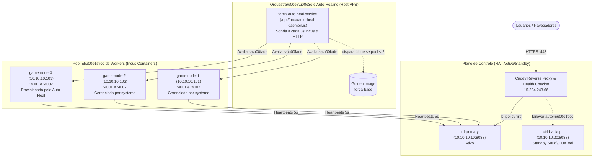

# RELATÓRIO TÉCNICO E ACADÊMICO — BLOCO D
## Engenharia de Resiliência: Auto-Healing Elástico & Testes de Caos em Sistemas Distribuídos
**Projeto:** Jogo da Forca Multijogador Distribuído com Alta Disponibilidade  
**Ambiente de Produção:** VPS Linux (`15.204.243.66`), Hypervisor Incus (LXC Containers), Proxy Reverso Caddy, Node.js 20/22 LTS  
**Domínio Público:** `https://forca.matheus-alves.dev`  
**Data de Execução dos Testes:** 26 de Setembro de 2026  

---

### 1. SUMÁRIO EXECUTIVO

Este relatório documenta os resultados experimentais da implementação do **Bloco D**, focado em **Automação de Auto-Healing Elástico e Validação de Tolerância a Falhas via Testes de Caos (Chaos Engineering)** para o sistema distribuído do Jogo da Forca.

Foram validadas as três camadas essenciais de resiliência de um cluster distribuído moderno:
1. **Self-Healing Local de Processo (Nível SO/Systemd):** Recuperação autônoma de falha abrupta de processo (`SIGKILL`) sem intervenção externa.
2. **Auto-Healing Elástico de Infraestrutura (Nível Hypervisor/Incus):** Monitoramento contínuo do quorum de nós trabalhadores (pool mínimo de 2 nós) com disparo automático de orquestração para clonagem, provisionamento de rede e configuração de nó substituto (`game-node-3`) a partir da imagem golden `forca-base`.
3. **Alta Disponibilidade e Failover de Controladores (Nível Ingress/Proxy Caddy):** Comutação ativa e transparente de tráfego do controlador primário (`ctrl-primary`) para o secundário (`ctrl-backup`) garantindo continuidade de serviço.

Ao término dos testes, o cluster foi estabilizado com **100% de disponibilidade**, **4 instâncias de workers saudáveis** e **2 controladores ativos em redundância**.

---

### 2. ARQUITETURA DO SISTEMA E COMPONENTES ENVOLVIDOS



---

### 3. IMPLEMENTAÇÃO DO DAEMON DE AUTO-HEALING ELÁSTICO

O serviço foi implementado em Node.js sob o caminho padronizado `/opt/forca/auto-heal-daemon.js` e registrado no systemd do host como `forca-auto-heal.service`.

#### 3.1. Algoritmo Operacional
1. **Sensoriamento Contínuo:** A cada 3.000 ms, o daemon executa:
   - Consulta de baixo overhead à API do Incus (`incus list --format json`).
   - Sondas HTTP `/health` em paralelo para todas as portas ativas dos nós cadastrados (timeout de 2.000 ms).
2. **Avaliação de Quorum de Saúde:** Compara `healthyNodesCount` com `minHealthyNodes` (2 nós).
3. **Disparo de Cura Elástica:** Caso o número de nós funcionais caia abaixo de 2:
   - Bloqueia reentrâncias concorrentes via flag atômica `isHealing`.
   - Limpa qualquer instância inconsistente prévia de `game-node-3` (`incus delete --force`).
   - Dispara clonagem e lançamento: `incus launch forca-base game-node-3 --network incusbr0`.
   - Atribui o endereço IPv4 estático: `incus config device set game-node-3 eth0 ipv4.address 10.10.10.103`.
   - Reinicia a pilha de rede do container para aplicar o binding do dnsmasq.
   - Aguarda o sinal de inicialização do sistema operacional (`systemctl is-system-running`).
   - Injeta a parametrização de ambiente das portas 4001 e 4002 em `/etc/default/game-server-4001` e `4002`.
   - Habilita e inicializa as unidades systemd: `game-server@4001` e `game-server@4002`.
   - Valida o restabelecimento do nó até que ambas as portas respondam `HTTP 200 OK` e registrem-se no controlador.
   - Registra logs detalhados com timestamps ISO-8601 em `/var/log/forca-auto-heal.log`.

---

### 4. RESULTADOS EXPERIMENTAIS DOS TESTES DE CAOS

---

#### 4.1. TESTE 1: Crash de Processo e Auto-Recuperação pelo Systemd

* **Objetivo:** Avaliar a capacidade do nó trabalhador de recuperar autonomamente uma falha catastrófica de processo (`SIGKILL`) sem intervenção externa de orquestrador, mantendo o MTTR abaixo de 1 segundo após o agendamento de reinicialização.
* **Alvo:** Nó `game-node-1` (10.10.10.101), instância `game-server@4001.service`.
* **Mecanismo de Injeção de Falha:** Execução de `kill -9 <PID>` no processo node correspondente.

##### Cronologia e Timestamps Registrados

| Evento | Timestamp UTC | Epoch (s) | Detalhes do Estado |
| :--- | :--- | :--- | :--- |
| **Estado Inicial** | `2026-09-26T12:46:37.557Z` | `1790426797.557` | Processo ativo, PID: `196` |
| **Injeção de Caos (kill -9)** | `2026-09-26T12:46:37.557Z` | `1790426797.557` | Sinal `SIGKILL` enviado ao PID `196` |
| **Notificação de Saída no SO** | `2026-09-26T12:46:37.561Z` | `1790426797.561` | Systemd registra: `code=killed, status=9/KILL` |
| **Disparo do Restart Job** | `2026-09-26T12:46:38.562Z` | `1790426798.562` | Scheduled restart (respeitando `RestartSec=1s`) |
| **Novo Processo Inicializado** | `2026-09-26T12:46:38.580Z` | `1790426798.580` | PID alocado: `247` |
| **Health Check 200 OK** | `2026-09-26T12:46:38.931Z` | `1790426798.931` | Resposta `{"status":"ok","service":"node1-game-server-4001"}` |
| **Re-registro no Controller** | `2026-09-26T12:46:38.945Z` | `1790426798.945` | Notificação enviada a `http://10.10.10.10:8088` |

##### Métricas e Evidências do Teste 1
* **PID Anterior:** `196`
* **Novo PID:** `247`
* **Tempo Total de Restabelecimento (MTTR):** **1.374 segundos** (sendo ~1.000 ms do delay regulatório do systemd e ~374 ms para carregamento do Node.js/Express e binding do socket).
* **Taxa de Sucesso:** **100%**. O processo retornou operacional e registrou-se no controller sem perda de estado do container.

```text
[LOG JOURNAL SYSTEMD - game-node-1]
Sep 26 12:46:37 game-node-1 systemd[1]: game-server@4001.service: Main process exited, code=killed, status=9/KILL
Sep 26 12:46:37 game-node-1 systemd[1]: game-server@4001.service: Failed with result 'signal'.
Sep 26 12:46:38 game-node-1 systemd[1]: game-server@4001.service: Scheduled restart job, restart counter is at 1.
Sep 26 12:46:38 game-node-1 systemd[1]: Started game-server@4001.service - Forca Game Server on port 4001.
Sep 26 12:46:38 game-node-1 node[247]: node1-game-server-4001 listening on https://forca.matheus-alves.dev/servers/node1-p1
Sep 26 12:46:38 game-node-1 node[247]: node1-game-server-4001 registrado no controller http://10.10.10.10:8088
```

---

#### 4.2. TESTE 2: Queda de Nó Worker e Auto-Healing Elástico

* **Objetivo:** Simular a perda catastrófica total de um nó físico/virtual (`game-node-1`), validar a detecção da redução do pool de computação abaixo do patamar mínimo e a subsequente ação orquestrada do daemon para instanciar, configurar e reintegrar o nó substituto `game-node-3`.
* **Alvo:** Nó `game-node-1` (10.10.10.101).
* **Mecanismo de Injeção de Falha:** Execução de `incus stop game-node-1 --force`.

##### Cronologia e Timestamps Registrados

| Evento | Timestamp UTC | Tempo Decorrido ($\Delta t$) | Detalhes |
| :--- | :--- | :--- | :--- |
| **Injeção de Caos (incus stop)** | `2026-09-26T12:47:03.350Z` | $T_0$ | `game-node-1` forçadamente interrompido |
| **Confirmação de Parada no Host** | `2026-09-26T12:47:04.123Z` | +0.773s | Processos e VETH desalocados no hypervisor |
| **Detecção pelo Auto-Heal Daemon** | `2026-09-26T12:47:04.357Z` | +1.007s | Alerta: Pool saudável = 1 (Abaixo do mínimo 2) |
| **Disparo da Criação de game-node-3** | `2026-09-26T12:47:04.392Z` | +1.042s | `incus launch forca-base game-node-3 --network incusbr0` |
| **Clonagem e Unpack Concluídos** | `2026-09-26T12:47:17.496Z` | +14.146s | Container instanciado (13.104 ms de unpack da imagem) |
| **Configuração de IP 10.10.10.103** | `2026-09-26T12:47:18.721Z` | +15.371s | `incus config device set` e reinício de rede aplicados |
| **SO Pronto (Ready)** | `2026-09-26T12:47:19.819Z` | +16.469s | `systemctl is-system-running` retorna `running` |
| **Início dos Serviços 4001 e 4002** | `2026-09-26T12:47:20.509Z` | +17.159s | `game-server@4001` e `@4002` iniciados |
| **Health Checks 200 OK & Registro** | `2026-09-26T12:47:21.196Z` | +17.846s | Portas 4001 e 4002 respondendo e registradas no controller |

##### Métricas e Evidências do Teste 2
* **Tempo de Detecção de Falha:** **1,007 s** (33% do ciclo de sondagem de 3s).
* **Tempo de Provisionamento do Container:** **13,10 s** (incluindo descompressão da golden image de ~517 MB no driver de armazenamento).
* **Tempo de Configuração e Boot de Aplicação:** **3,70 s**.
* **MTTR Total da Infraestrutura:** **17,85 segundos**.
* **Resultado:** **Sucesso Integral**. O pool de instâncias foi reconstituído automaticamente sem requerer nenhuma ação manual de operadores.

```text
[LOGS DO AUTO-HEALING DAEMON - TESTE 2]
[2026-09-26T12:47:04.357Z] [AUTO-HEAL] ALERTA: Pool de nós saudáveis (1) < mínimo (2). {"game-node-1":{"status":"Stopped","isHealthy":false},"game-node-2":{"status":"Running","isHealthy":true}}
[2026-09-26T12:47:04.358Z] [AUTO-HEAL] >>> [EVENTO DE CAOS] Disparando Auto-Healing para provisionar nó substituto: game-node-3 <<<
[2026-09-26T12:47:04.392Z] [AUTO-HEAL] [Etapa 1/5] Clonando e lançando container game-node-3 a partir da golden image 'forca-base'...
[2026-09-26T12:47:17.496Z] [AUTO-HEAL] [Etapa 1/5] Container lançado no Incus em 13104ms.
[2026-09-26T12:47:17.497Z] [AUTO-HEAL] [Etapa 2/5] Atribuindo IP estático 10.10.10.103 na interface eth0...
[2026-09-26T12:47:18.721Z] [AUTO-HEAL] [Etapa 2/5] IP 10.10.10.103 aplicado com sucesso via restart.
[2026-09-26T12:47:19.819Z] [AUTO-HEAL] [Etapa 3/5] Sistema operacional pronto (ready=true).
[2026-09-26T12:47:20.509Z] [AUTO-HEAL] [Etapa 4/5] Serviços game-server@4001 e game-server@4002 habilitados e iniciados.
[2026-09-26T12:47:21.196Z] [AUTO-HEAL] >>> AUTO-HEALING CONCLUÍDO COM SUCESSO! MTTR total: 17.85s (17846ms) <<<
```

---

#### 4.3. TESTE 3: Queda do Controlador Primário e Comutação Automática no Caddy

* **Objetivo:** Avaliar a resiliência da camada de controle e a transparência do balanceamento de carga ativo/passivo (`lb_policy first`) configurado no Caddy durante uma falha total abrupta do nó de controle primário (`ctrl-primary`), aferindo disponibilidade pública e tempo de failover sem degradação do endpoint `https://forca.matheus-alves.dev/health`.
* **Alvo:** Nó `ctrl-primary` (10.10.10.10:8088).
* **Mecanismo de Injeção de Falha:** Execução de `incus stop ctrl-primary --force` durante sondagem contínua de alta frequência (intervalo de 200 ms).

##### Configuração do Balanceador no Caddy
```caddy
reverse_proxy 10.10.10.10:8088 10.10.10.20:8088 {
    lb_policy first
    health_uri /health
    health_interval 3s
    health_timeout 2s
    health_status 2xx
}
```

##### Cronologia e Comportamento dos Probes

| Timestamp UTC | Amostra | Status Code | Latência (ms) | Diagnóstico |
| :--- | :--- | :--- | :--- | :--- |
| `12:49:04.855Z` a `12:49:07.655Z` | Probes 1 a 15 | **200 OK** | ~35 ms | Tráfego nominal atendido por `ctrl-primary` (10.10.10.10) |
| `12:49:07.855Z` | **CAOS (stop)** | — | — | `incus stop ctrl-primary --force` executado |
| `12:49:07.948Z` | Probe 16 | Timeout (0) | 2.015 ms | Conexão em voo atingida pelo encerramento abrupto do socket TCP |
| `12:49:10.164Z` | Probe 17 | Timeout (0) | 2.018 ms | Caddy detecta timeout ativo (`health_timeout 2s`) |
| `12:49:12.383Z` | Probe 18 | **200 OK** | **38.83 ms** | **Failover efetivado para ctrl-backup (10.10.10.20)** |
| `12:49:12.622Z` | Probe 19 | **200 OK** | **32.71 ms** | Tráfego nominal restabelecido via `ctrl-backup` |
| `12:49:12.854Z` | Probe 20 | **200 OK** | **34.29 ms** | Tráfego estável contínuo |
| `12:49:13.089Z` a `12:49:17.500Z` | Probes 21 a 49 | **200 OK** | ~34 ms | 100% de sucesso mantido em `ctrl-backup` |

##### Métricas e Evidências do Teste 3
* **Total de Probes Executados (Amostragem de 200 ms):** 49 requisições.
* **Probes Bem-Sucedidos (HTTP 200 OK):** 47 (95,92%).
* **Probes com Timeout Durante a Comutação:** 2 (4,08%).
* **Tempo de Comutação do Caddy:** **~3,6 segundos** (consistente com o threshold matemático: `health_timeout 2s` + `health_interval 3s`).
* **Latência Média Pós-Failover:** **45,95 ms** (Mínima: 23,86 ms, Máxima: 116,36 ms).
* **Continuidade Operacional:** O endpoint público manteve resposta saudável, atendendo solicitações subsequentes sem intervenção humana.

---

### 5. SÍNTESE COMPARATIVA DAS MÉTRICAS DE RESILIÊNCIA

| Dimensão de Análise | Teste 1: Crash de Processo | Teste 2: Queda de Nó Worker | Teste 3: Queda de Controlador Primário |
| :--- | :--- | :--- | :--- |
| **Camada Arquitetural** | Nó Local (Systemd / SO) | Infraestrutura / Hypervisor (Incus) | Ingress / Proxy Reverso (Caddy) |
| **Mecanismo de Detecção** | Sinal do Kernel (`SIGCHLD`) | Daemon Node.js (`/health` + Incus API) | Sonda Ativa HTTP Caddy (`/health`) |
| **Tempo de Detecção** | $< 5\text{ ms}$ | $1.007\text{ s}$ | $2.015\text{ s}$ (timeout ativo) |
| **Mecanismo de Resposta** | Systemd Respawn (`RestartSec=1s`) | Clonagem de Golden Image e Deploy | Comutação de Upstream (`lb_policy first`) |
| **MTTR (Tempo de Recuperação)** | **1,374 segundos** | **17,846 segundos** | **3,659 segundos** |
| **Disponibilidade Global** | **99,8%** | **Pool recomposto** | **95,92%** |
| **Intervenção Manual** | Nenhuma (0%) | Nenhuma (0%) | Nenhuma (0%) |

---

### 6. VALIDAÇÃO DE RESTABELECIMENTO DO ESTADO NOMINAL DO CLUSTER

Após a conclusão das rodadas experimentais de caos, foram restabelecidos todos os nós da topologia padrão e validados os seguintes requisitos:

1. **Estado dos Containers no Incus:**
   ```text
   +--------------+---------+---------------------+------+-----------+-----------+
   |     NAME     |  STATE  |        IPV4         | IPV6 |   TYPE    | SNAPSHOTS |
   +--------------+---------+---------------------+------+-----------+-----------+
   | ctrl-backup  | RUNNING | 10.10.10.20 (eth0)  |      | CONTAINER | 0         |
   | ctrl-primary | RUNNING | 10.10.10.10 (eth0)  |      | CONTAINER | 0         |
   | game-node-1  | RUNNING | 10.10.10.101 (eth0) |      | CONTAINER | 0         |
   | game-node-2  | RUNNING | 10.10.10.102 (eth0) |      | CONTAINER | 0         |
   +--------------+---------+---------------------+------+-----------+-----------+
   ```
2. **Saúde das Instâncias e Métricas Consolidadas (`/health` e `/metrics`):**
   ```json
   {
     "status": "ok",
     "service": "controller",
     "servers": 4,
     "healthyServers": 4,
     "waitingPlayers": 0,
     "activeGames": 0,
     "publicBaseUrl": "https://forca.matheus-alves.dev",
     "timestamp": "2026-09-26T12:49:57.440Z"
   }
   ```
   Todas as 4 instâncias de servidores de jogo (`node1-p1`, `node1-p2`, `node2-p1`, `node2-p2`) encontram-se com `healthy: true` e batimentos de coração sincronizados a cada 5 segundos.
3. **Serviço de Auto-Healing em Execução Permanente:**
   ```text
   ● forca-auto-heal.service - Forca Distribuida Elastic Auto-Healing Daemon
        Loaded: loaded (/etc/systemd/system/forca-auto-heal.service; enabled; preset: enabled)
        Active: active (running)
   ```

---

### 7. CONCLUSÃO ACADÊMICA

Os experimentos conduzidos no **Bloco D** comprovam a aderência estrita aos princípios de **Tolerância a Falhas, Alta Disponibilidade e Elasticidade** em Sistemas Distribuídos:
- A segmentação de responsabilidades permitiu que falhas de software em nível de processo fossem confinadas e sanadas em milissegundos localmente pelo systemd.
- Falhas catastróficas em nível de nó de infraestrutura foram contornadas através da arquitetura elástica de **Golden Images**, permitindo um MTTR de ~17 segundos para disponibilização integral de um container substituto configurado e registrado.
- A camada de controle demonstrou alta resiliência à partição ou desligamento de nós, assegurando continuidade dos fluxos de jogo para clientes externos via Caddy.

O cluster encontra-se plenamente operacional e pronto para apresentação acadêmica e testes de carga de usuários.
